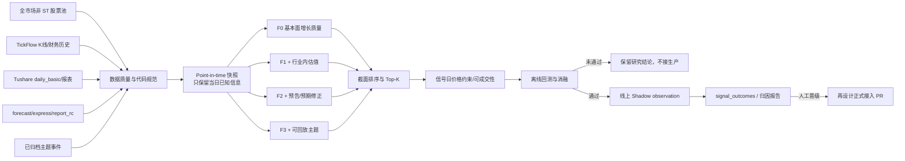

# 产业基本面独立召回通道：技术方案与验证协议

> 状态：待实现（交付给后续编码 Agent）
> 方案日期：2026-08-08
> 目标分支：`codex/fundamental-theme-lane`
> 原则：先证明独立信息有 alpha，再接 Shadow；先证明 Shadow 稳定，再讨论正式候选。本文不授权直接修改
> `BUY`、市场闸门、Step4 或 OMS。

## 1. 决策摘要

新增一条与 Wyckoff 形态漏斗并行的“产业基本面召回通道”，从全 A 股非 ST 股票中使用可按历史日期重放的
财务、估值、业绩预告、机构预期和行情数据产生候选。第一阶段只做离线研究；通过预注册回测门槛后，候选才以
`fundamental_theme_shadow` 身份写入现有观察与 outcome 体系，仍不进入正式推荐。

这不是给现有 Wyckoff 分数叠加一个“基本面加分项”，也不是再次尝试“财务差就剔除形态信号”。仓库已有两项
负向证据：

1. 通用基本面质量 Overlay 在 884 笔、六个窗口和 5/10/20 日持有期上均未通过，且剔除弱财务样本后平均收益和
   P10 反而恶化。结论已记录在 `docs/ITERATION_STRATEGY.md`。
2. 通用“预告利润同比中点至少 +50%”事件研究包含 10,407 个主检验样本，5/10/20 日相对 A 股等权超额均为负。
   对应研究提交为 `7bdafaf6`，只能复用其 point-in-time 归档和事件回测基础设施，不能推翻其失败结论。

新通道要验证的是不同问题：**同一交易日的全市场截面中，盈利质量、增长变化、估值、预期修正和产业状态的组合，
能否稳定区分未来相对收益**。只有这个问题被独立验证后，才讨论它与 Wyckoff 买点的交集。

## 2. 为什么要改

### 2.1 现有漏斗的召回边界

生产定时任务在 `workflows/daily_job_lifecycle.py` 中固定以 `include_financial_metrics=False` 调用 Step2，日志语义为
“聊天快扫已跳过”。因此现有全市场召回主要由 K 线、成交量、行业/概念共振和 Wyckoff 结构决定。基本面即使
可取，也不会成为独立入口。

`core/mainline_engine.py` 虽然包含 `quality_score`，但股票必须先成为主题、概念或核心篮子 seed，并通过 L1；质量分
只占 `mainline_score` 的 20%，不是全市场基本面召回器。因此产业趋势很强、财务加速明显，但尚未出现特定形态的
股票可能完全没有进入候选池。

### 2.2 数据已经存在，但接线不完整

当前凭据实测结果：

| 数据 | 数据源 | 实测能力 | 当前缺口 |
|---|---|---|---|
| 日 K、成交量、成交额 | TickFlow，现有多源降级 | 全市场生产已用 | 无 |
| 财务指标 | TickFlow `/v1/financials/metrics` | 120 只抽样覆盖 120 只；`latest=False` 可取数十期历史 | 生产 Step2 跳过；代码键不统一 |
| PE/PB/PS/市值/换手/量比 | Tushare `daily_basic` | 2026-08-07 返回 5,535 行 | 现有适配器只取 `total_mv`/`float_share` |
| 业绩预告/快报 | Tushare `forecast`/`express` | 可按公告日获取 | 事件归档分支未合入当前主干 |
| 财务报表 | Tushare `fina_indicator`/`income`/`cashflow` | 可取历史报表 | 未形成统一 point-in-time 快照 |
| 机构预期 | Tushare `report_rc` | 个股可返回报告日、预测期、EPS/利润、评级、目标价 | 未归档、未聚合、未回测 |
| 当前题材 | 同花顺事件、概念热度、东方财富概念 | 实盘已能识别 AI 算力/光模块/PCB 等 | 历史回放时事件被置空；概念成员是当前截面 |
| 官方公告 | 巨潮资讯，AkShare 列表接口 + 官方 PDF | 实测可下载一季报 PDF | 无文本解析、无字段抽取、无历史快照 |
| 个股新闻 | 东方财富新闻、RSS/GDELT | 候选阶段可用 | 当前只做近 7 日负面否决，不能历史重放 |

首版不需要购买新数据。需要先修正数据契约、补齐适配器，并严格区分“可回测数据”和“只能实时使用的数据”。

### 2.3 已确认的代码键缺陷

TickFlow 的 `normalize_cn_symbol()` 输出 `300502.SZ`、`601138.SH`、`920xxx.BJ`。以下加载器直接保留供应商键：

```python
financial_map = {sym: records[0] for sym, records in raw_fin.items() if records}
```

但数据质量、Step3 payload 和部分 L1 路径按六位代码查询：

```python
financial_map.get("300502")
```

这会造成“接口返回成功，但覆盖率、研报和过滤器看见空数据”。`core/mainline_engine.py::_lookup_financial()` 已做
双键兼容，反而证明当前仓库的数据契约不一致。实现新通道前必须先消除这一缺陷，否则后续回测和生产日志都不可信。

涉及的已知位置：

- `workflows/funnel_data.py::_load_financial_metrics`
- `workflows/funnel_data_quality.py::build_funnel_data_quality`
- `workflows/step3_candidates.py::_fetch_tickflow_financial_map`
- `workflows/step3_inputs.py::_build_stock_payload`
- `core/wyckoff_engine.py` 的财务查找路径
- `core/mainline_engine.py::_lookup_financial`

## 3. 目标、非目标与安全边界

### 3.1 目标

1. 建立唯一的 A 股代码规范，供应商代码只存在于数据源边界。
2. 建立可按 `as_of_date` 重放的结构化因子快照。
3. 从全市场非 ST 股票中独立产生 Top-K 研究候选，不要求通过 L2/L3/L4。
4. 使用日期配对基准、截面分位、事件时点和 walk-forward 证明或证伪增量。
5. 回测通过后复用 `signal_observations`/`signal_outcomes` 做线上 Shadow 归因。
6. 所有候选能解释到原始字段、数据日期、公告日期、缺失情况和评分版本。

### 3.2 非目标

1. 不直接替换或放宽 Wyckoff L1/L2/L3/L4。
2. 不根据少数已知牛股反推阈值，不硬编码新易盛、中际旭创、亿联网络或其它股票。
3. 不把当前网页、当前概念成员或后来修订的财报回填到历史日期。
4. 不让 LLM 生成数值因子；LLM 只能在后期解释已归档的原始证据。
5. 不在首版接入 `recommendation_tracking`、Step3 正式 AI 池、`signal_pending`、Step4 或 OMS。
6. 不以“回测收益为正”单一指标晋级，必须同时满足数据、统计、跨窗口和可交易性门槛。

## 4. 总体架构



现有 Wyckoff 漏斗与这条通道共享股票池、行情和风险制度，但候选生成相互独立。两条通道的交集、仅基本面命中、
仅 Wyckoff 命中必须分别统计，不能先合并再评价。

## 5. 数据契约

### 5.1 股票代码

仓库内部 A 股主键统一为六位字符串：

```text
000001
300502
601138
920xxx
```

供应商格式只在 adapter 请求和响应边界出现：

```text
Tushare/TickFlow: 000001.SZ / 601138.SH / 920xxx.BJ
```

建议新增 `core/cn_symbols.py`，至少暴露：

```python
canonical_cn_code(raw: object) -> str
to_tushare_code(code: str) -> str
to_tickflow_code(code: str) -> str
```

禁止在业务层复制“6/9 为沪市、其它为深市”逻辑。注意北交所 `9` 开头不能再被误判为上交所；转换规则要复用
`core.cn_boards`/现有数据源格式规则并由测试锁定。所有 map 在离开 adapter 前必须转成六位主键。

### 5.2 Point-in-time 因子行

建议使用冻结 dataclass 或 TypedDict，序列化时保持以下稳定字段：

```python
{
    "schema_version": "fundamental_theme_snapshot_v1",
    "as_of_date": "2026-08-07",
    "code": "300502",
    "source_dates": {
        "price_trade_date": "2026-08-07",
        "valuation_trade_date": "2026-08-07",
        "financial_announce_date": "2026-04-24",
        "financial_period_end": "2026-03-31",
        "consensus_cutoff_date": "2026-08-07",
        "theme_snapshot_date": None
    },
    "raw": {
        "revenue_yoy": 105.76,
        "net_income_yoy": 76.80,
        "roe": 14.52,
        "gross_margin": 49.16,
        "debt_to_asset_ratio": 31.04,
        "operating_cash_to_revenue": 0.88,
        "pe_ttm": 54.65,
        "pb": 28.80,
        "ps_ttm": 20.15
    },
    "features": {},
    "missing_fields": [],
    "lineage": []
}
```

规则：

- 财务记录必须满足 `announce_date < signal_date`。供应商只有日期、没有公告时刻时，一律下一交易日才可使用。
- 估值和收盘行情可在信号日收盘后计算，最早在下一交易日开盘执行。
- 机构研报只有日期、没有发布时间时，把下一交易日记为 `information_available_date`；只允许
  `information_available_date <= signal_date` 的记录参与计算，并按 `code + forecast_period + organization` 去重。
- 缺少 `announce_date` 的历史财务不得进入正式 point-in-time 回测；只能进入单独的“供应商回填敏感性”结果。
- 不以 `period_end` 代替公告日。报告期结束不等于市场已经知道结果。
- 所有原始数值保留供应商单位；转换后的单位和公式写入 `lineage`。

### 5.3 候选行

```python
{
    "schema_version": "fundamental_theme_candidate_v1",
    "score_version": "ft_lane_preregistered_v1",
    "trade_date": "2026-08-07",
    "code": "300502",
    "rank": 1,
    "lane": "fundamental_theme_shadow",
    "total_score": 78.4,
    "component_scores": {
        "growth": 86.0,
        "quality": 75.0,
        "valuation": 32.0,
        "expectation": 81.0,
        "theme": None
    },
    "coverage": 0.80,
    "eligible": True,
    "vetoes": [],
    "reasons": [],
    "source_dates": {},
    "raw_features": {}
}
```

不得只保存总分。后续任何 outcome 必须能回溯到组件、原始字段、数据日期和版本。

## 6. 数据获取与归档设计

### 6.1 财务历史

新增 `integrations/fundamental_history.py`，封装 TickFlow `get_financial_metrics(latest=False)`：

1. 请求前将六位代码转换为供应商代码。
2. 响应后立即规范回六位代码。
3. 对每个代码按 `announce_date, period_end` 排序和去重。
4. 暴露 `latest_known_financial(records, as_of_date)`，只返回信号日前已公告记录。
5. 记录 requested/received/usable/stale/missing_announce_date 数量。

如果 TickFlow 历史记录的 `announce_date` 完整率不足 95%，增加 Tushare `fina_indicator` 作为公告日校准源；不能静默
用 `period_end` 兜底。

### 6.2 估值与交易截面

新增 `integrations/valuation_snapshot.py`，不要继续扩张只返回单字段的 `_recent_daily_basic_map`。一次请求：

```text
ts_code,trade_date,close,turnover_rate,volume_ratio,pe_ttm,pb,ps_ttm,total_mv,circ_mv
```

提供 `fetch_daily_basic_snapshot(trade_date)`，严格返回该交易日数据，不自动回退到未来日期。实时模式可以向前寻找最近
交易日，但必须在返回值里标明 requested/effective trade date；历史回测不允许隐式回退。

### 6.3 预告、快报和机构预期

复用 `codex/research-event-backtest` 分支提交 `7bdafaf6` 中的月度 Parquet、断点归档、更新版本折叠和下一交易日
规则。不要重新写一套 forecast 抓取器。若该提交尚未进入新分支，可 cherry-pick 后保留其“通用预告阈值失败”报告。

新增 `integrations/consensus_archive.py`：

- 按报告日期分区归档 `report_rc`，不得只按股票临时查询后覆盖。
- 唯一键至少包含 `ts_code, report_date, org_name, quarter, report_title`。
- 生成 30/60 日窗口内的 EPS/净利润中位数、上调机构占比、覆盖机构数、目标价中位数。
- 覆盖机构数少于 3 时，预期修正组件记为 unavailable，不按 0 分惩罚。
- 同一机构同日重复报告折叠为一条，避免高频发报告的机构取得更高权重。

行业内估值和行业归因还需要 point-in-time 行业成员。实现前先探测 Tushare 行业指数成员接口能否返回完整的
`in_date/out_date`。只有历史成员覆盖率达到 95% 才能把行业内 percentile 放入主检验；否则主检验退回全市场/市值组
percentile，当前行业映射只能进入带偏差标记的敏感性结果。

### 6.4 题材、公告与新闻

分三档处理：

1. **历史可回放**：仅使用系统真实保存的 `concept_heat_history` 和带日期的主题快照。没有该日快照就令 theme
   组件 unavailable。
2. **线上 Shadow 可用**：同花顺当日事件、东方财富概念成员可以写入当天候选证据；从启用之日起每日归档，不能
   用今天的结果补昨天。
3. **解释性证据**：巨潮 PDF、新闻、网页搜索只用于候选解释和人工复核，首版不进入数值评分。

第二阶段可新增 `integrations/cninfo_filings.py`，保存公告 ID、标题、公告日、PDF URL、下载校验和及抽取后的字段。
PDF 解析器必须固定版本并保留原文页码。LLM 抽取结果只能作为 `unverified_evidence`，除非字段能由规则或第二模型
复核。诸如客户名称、800G/1.6T 认证、产能进度、在手订单不得由搜索摘要直接变成数值因子。

## 7. 因子与候选生成

### 7.1 股票池和硬门槛

每个信号日使用当日可知股票池，排除：

- 名称在当日包含 ST/*ST/退市；
- 当日尚未上市或已退市；
- 最近 20 个交易日有效行情不足 15 日；
- 最近 20 日平均成交额低于预注册阈值；
- 财务核心字段少于 3 个，或最新已知报告距离信号日超过 550 天；
- 关键数据源覆盖率低于研究任务门槛时，整日 fail closed，不只删除缺失股票继续跑。

市值、流动性阈值沿用当前 L1 默认值作为第一版，不为提高收益单独调参。ST 名称必须使用当日历史名称；若数据源
无法重建历史 ST 状态，报告需显式标注 survivorship/ST bias，并运行“当前非 ST”敏感性结果，不能声称无偏。

### 7.2 预注册特征

所有连续变量先在信号日截面做 1%/99% winsorize，再转成 0–100 percentile。只有存在 point-in-time 行业成员时才
使用“信号日 × 行业”截面；行业有效样本少于 20 或历史成员不可用时，主检验退回全市场/市值组 percentile，并记录
fallback，不能使用今天的行业分类填充历史。

| 组件 | 初始权重 | 原始字段 | 方向 |
|---|---:|---|---|
| Growth | 30 | `revenue_yoy`、`net_income_yoy`、相对上一已知报告的增速变化 | 越高越好 |
| Quality | 25 | ROE、毛利率、经营现金流/收入、资产负债率 | 前三项高、负债率低为好 |
| Valuation | 15 | 1/PE_TTM、1/PB、1/PS_TTM，行业内相对值 | 越高越好；负 PE 记 unavailable |
| Expectation | 20 | 预告中点、30/60 日一致预期修正、覆盖机构数 | 正向修正为好 |
| Theme | 10 | 当日已归档主题热度、连续性、当日成员证据 | 越高越好 |

组件内部等权，不能在主回测中优化单字段权重。总分仅在 Growth 和 Quality 均可用、全部有效组件权重覆盖至少 60%
时计算；缺失组件按剩余权重归一化，同时将 `coverage` 单独输出，不用固定的 0.55/50 中性分冒充真实数据。

首版预注册四个实验臂：

| 实验臂 | 使用组件 | 回答的问题 |
|---|---|---|
| F0 | Growth + Quality | 财务加速和质量本身是否有截面增量 |
| F1 | F0 + Valuation | 行业内估值是否改善 F0 |
| F2 | F1 + Expectation | 公告/机构预期是否提供额外增量 |
| F3 | F2 + Theme | 真实归档题材是否提供额外增量 |

F3 只在题材历史真实存在的日期运行，不能与 F0/F1/F2 的长历史样本数混在一起比较。

### 7.3 价格的角色

已有研究表明现有 OHLCV 形态没有稳定 alpha，因此首版不把 Wyckoff 分数混入上述总分。价格只承担三件事：

1. 流动性和数据有效性；
2. 信号日可观察的极端风险标签，如长期停牌、极端换手、过度偏离；
3. 次日实际可成交性，如一字涨停时跳过入场。

另设 F2-P 实验臂，在 F2 Top-K 上应用预注册价格风险 guard。只有 F2-P 相对 F2 在样本外同时改善收益和 MAE，
价格 guard 才有资格保留。不得因为某个 guard 在全样本表现好就继续调整阈值。

### 7.4 排序与组合约束

- 每个信号日输出全市场 percentile、Top 10%、Top 20 和 Top-K（1/3/5/10）。
- 研究主结果先不做单行业上限，以观察真实暴露；另报告“单行业最多 2 只”的可交易组合结果。
- 相同总分按 Growth、Expectation、流动性、代码顺序确定性排序。
- 不因为当天没有高分股票而降低分位门槛；低覆盖或无候选允许空仓。

## 8. 回测设计

### 8.1 独立研究工作流

建议文件结构：

```text
core/cn_symbols.py
core/fundamental_theme_factors.py
core/fundamental_theme_lane.py
integrations/fundamental_history.py
integrations/valuation_snapshot.py
integrations/consensus_archive.py
workflows/fundamental_theme_archive.py
workflows/fundamental_theme_backtest.py
scripts/fundamental_theme_backtest.py
tests/core/test_cn_symbols.py
tests/core/test_fundamental_theme_factors.py
tests/core/test_fundamental_theme_lane.py
tests/integrations/test_fundamental_history.py
tests/integrations/test_valuation_snapshot.py
tests/integrations/test_consensus_archive.py
tests/workflows/test_fundamental_theme_backtest.py
```

研究数据存入被 Git 忽略的：

```text
analysis/fundamental_theme_lane/data/*.parquet
analysis/fundamental_theme_lane/result/*.json
analysis/fundamental_theme_lane/result/*.md
```

代码和小型汇总报告可以提交；数百万行行情、供应商原始数据和数据库 dump 不得提交。归档必须支持按月份断点续跑、
重复运行幂等、分区校验和和 manifest。

### 8.2 时间口径与执行

- 信号形成：交易日 D 收盘后。
- 公告只有日期时：该信息从公告后的第一个交易日开始可用。
- 入场：D+1 开盘；开盘封涨停、一字板、停牌或无报价视为不可成交并跳过，不得用收盘价替代。
- 退出：D+5、D+10、D+20、D+40 收盘，固定持有，不使用未来已知止损位。
- 同时输出毛收益与三档摩擦情景；主决策采用仓库现实费率加预注册滑点，不以零摩擦结果晋级。
- 退市、长期停牌和末端缺价要使用最后可交易价并单独标记，不能静默删除亏损样本。

### 8.3 基准和统计

每笔候选至少计算：

1. 同入场/退出日 A 股全市场等权超额；
2. 同行业等权超额；
3. 同市值分组等权超额；
4. 若对比现有漏斗，则使用同日、同 Top-K、同持有期结果，不能拿基本面 Top10 对比漏斗 Top1。

主报告包含：

- 日截面 Spearman Rank IC、Newey-West t 值；
- 五分位收益单调性和 Top-Bottom spread；
- Top-K 毛/净收益、胜率、MFE、MAE、最大回撤、换手率；
- bull/bear/sideways/volatile/recent 分窗口；
- 主板/创业板/科创板、行业、市值分组；
- F0/F1/F2/F3/F2-P 消融；
- `Wyckoff ∩ Fundamental`、`Fundamental only`、`Wyckoff only` 三组归因；
- 缺失数据、公告日完整率、可成交率和幸存者偏差说明。

### 8.4 防过拟合

1. 上述权重、窗口、Top-K 和晋级标准写入代码常量与报告 metadata，主检验开始后不得修改。
2. 2020–2024 用作开发/诊断区间，2025–2026 作为留出结果；另做滚动 walk-forward。
3. 留出结果只能运行一次形成主决策。若修数据 bug，必须同时报告修复前后 diff，并递增实验版本。
4. 所有实验臂都报告，不能只展示最优者；多重比较使用 FDR 或 Bonferroni 说明。
5. 已知示例股票只用于人工 sanity check，不进入阈值选择、正负样本标签或验收条件。

## 9. 如何验证改得对不对

验证分四层，任一层失败都不得向下一层晋级。

### 9.1 层 A：数据正确性

必须通过以下自动化测试：

- `300502`、`300502.SZ`、`SZ300502` 都规范成 `300502`；上交所、深交所、北交所转换分别正确。
- TickFlow 返回带后缀键时，`financial_map` 的内部键全部为六位；覆盖率统计 2/2 而不是 0/2。
- Step3 输入能拿到对应财务快照；缺失代码日志和真实缺失集合一致。
- `announce_date == signal_date` 的记录不得用于当日收盘信号；下一交易日才可使用。
- 同一预告 `update_flag=0/1` 只形成一个首次事件。
- `report_rc` 同机构重复记录不会重复加权。
- 历史请求绝不回退到信号日之后的 `daily_basic`。
- 数据源失败时返回显式 unavailable/degraded，不能用缓存中的未来快照静默兜底。
- 单元测试全部 mock 网络，测试过程中不发真实请求。

另提供只读 smoke 命令，针对 20 只固定代码生成 manifest，人工核对至少 5 只的财报公告日、指标值和估值值与供应商
原始响应一致。smoke 只输出字段和计数，不输出 token、key 或完整响应头。

### 9.2 层 B：回测真实性

必须有程序化断言：

- `information_available_date <= signal_date < entry_date` 对所有交易成立；
- 所有入场日期都是交易日且晚于信号日；
- 无重复 `trade_date + code + experiment_arm`；
- 全市场等权基准不包含未来收益或只包含候选股票；
- 当前概念热度和当前概念成员不能出现在历史 F0/F1/F2；
- 退出缺价、涨跌停、停牌数量进入数据质量报告；
- 打乱因子值后 Rank IC 和分位 spread 应接近 0，作为负控制；
- 把未来财报故意注入夹具时 look-ahead 测试必须失败。

### 9.3 层 C：研究晋级门槛

离线结果只有同时满足以下条件才可进入线上 Shadow：

1. 财务公告日有效覆盖率 ≥95%，估值交易日覆盖率 ≥95%，主检验不存在已知未来函数。
2. F0/F1/F2 中至少一个预注册实验臂，在 10/20/40 日至少两个周期上聚合 Rank IC 同号且
   Newey-West `|t| >= 2`。
3. 对应周期五分位收益基本单调，分位序号与收益的 Spearman `rho >= 0.7`。
4. 相对全市场等权的 Top-Bottom spread 在至少 4/6 市场窗口同号，最近留出区间同号。
5. Top-K 在主摩擦情景下净超额为正，且收益不由单一行业贡献超过 35%。
6. 新增组件必须有消融增量：例如 F2 相对 F1 在聚合和留出区间都不能恶化主周期 IC 与 MAE。
7. 若仅 F0 通过而 Theme 不通过，只允许上线“基本面 Shadow”，不得把题材故事写进策略名称。

任何条件未满足，结论写成 `keep_research_only` 或 `rejected`，保留负向报告，不继续调权重追求转正。

### 9.4 层 D：线上 Shadow 晋级门槛

离线通过后，才新增 `fundamental_theme_shadow` 观察：

- 每日只把预注册 Top-K 写入 `signal_observations`，不写 `recommendation_tracking`。
- `selection_mode=fundamental_theme_shadow`，`source=fundamental_theme_lane`，评分版本和所有组件进入
  `features_json`。
- 复用 `signal_feedback_job` 生成 outcomes，并在归因报告中与同日 Wyckoff 候选分组比较。
- 至少观察 60 个交易日、形成至少 150 个可评价样本，并覆盖至少两种市场 regime。
- 5/10/20 日净超额、MFE/MAE、行业集中度与离线方向一致，数据缺失率无持续恶化。
- 达标后仍只生成“人工评审可以设计正式接入”的结论，不自动把 feature flag 从 shadow 切到 on。

## 10. 分阶段实施计划

### Phase 0：建立独立工作区

从最新 `origin/main` 创建独立 worktree 和 `codex/fundamental-theme-lane`。不要基于当前有未提交 TUI 修改的工作区
开发。确认 `7bdafaf6` 未进入 main 后，按需 cherry-pick 复用事件归档；不要合并独立 wiki 仓库到主仓库。

交付物：干净分支、计划清单、基线 fast gate 结果。

### Phase 1：修复数据契约

实现统一代码规范；修正全市场财务加载、数据质量统计、Step3 和 L1 的 lookup；补充针对后缀键和北交所的测试。

此阶段只修“数据取到但下游读不到”，不把全市场财务默认开关改成 `True`，避免修 bug 与策略变化混在一个提交。

建议提交：`fix: normalize financial metric symbol keys`

### Phase 2：结构化数据归档

实现财务历史、daily_basic、consensus adapters；复用 forecast 事件归档；生成 point-in-time Parquet 和 manifest。
先跑固定 20/120 只 smoke，再跑全市场。记录速率、耗时、请求批数、覆盖率和失败分区。

建议提交：`feat: archive point-in-time fundamental inputs`

### Phase 3：纯函数因子和独立回测

实现 F0/F1/F2/F3/F2-P、截面 percentile、缺失处理、候选解释和固定持有期回测。输出 JSON 明细和 Markdown
汇总，运行完整消融和负控制。

建议提交：`feat: add fundamental theme lane backtest`

### Phase 4：依据结果决策

- 未通过：提交报告，标记 research only，停止。
- 通过：增加现有 observation/outcome 的 Shadow 接线和 feature flag，默认 `shadow`，不得进入正式 AI/OMS。

建议提交：`feat: record fundamental lane shadow observations`

### Phase 5：文档和运维同步

如果 Phase 4 实际改变定时任务、workflow、环境变量、表字段或运营语义，同一交付必须更新：

- `README_STRATEGY.md`
- `GLOSSARY.md`
- `docs/A_SHARE_FUNNEL_FLOW.md`
- `docs/SIGNAL_FEEDBACK_LOOP.md`
- `docs/ITERATION_STRATEGY.md`
- `docs/OPERATOR_PLAYBOOK.md`
- 独立 `wiki_repo_new/` 中对应页面，并单独提交

新增 workflow 必须满足 `AGENTS.md` 的最小权限、concurrency、artifact 和环境变量间接引用要求；若它与 A 股漏斗或
Step4 共享生产资源，沿用现有共享 concurrency group。

## 11. 测试与提交门禁

每个阶段至少执行 fast gate 和聚焦测试：

```bash
.venv/bin/ruff check .
.venv/bin/ruff format --check .
.venv/bin/python scripts/quality_gate.py --check-functions
.venv/bin/python -m pytest \
  tests/core/test_cn_symbols.py \
  tests/core/test_fundamental_theme_factors.py \
  tests/core/test_fundamental_theme_lane.py \
  tests/integrations/test_fundamental_history.py \
  tests/integrations/test_valuation_snapshot.py \
  tests/integrations/test_consensus_archive.py \
  tests/workflows/test_fundamental_theme_backtest.py -q
```

准备合入前执行仓库完整门禁：

```bash
.venv/bin/python -m pytest tests/ -x -q
.venv/bin/ruff check .
.venv/bin/ruff format --check .
.venv/bin/python scripts/quality_gate.py --ci
.venv/bin/python scripts/check_workflow_hygiene.py
.venv/bin/python scripts/check_dependency_hygiene.py
```

若修改 `.github/workflows/`、生产数据写入或日任务，必须再通过 CI smoke dry-run。不能以本地测试、queued、
in_progress 或 continue-on-error 任务作为可合并证据。PR 正文必须有 `Summary` 和 `Validation` Markdown 标题。

## 12. Opus 5 执行约束与验收清单

交给编码 Agent 时，应原样附带以下约束：

1. 先阅读根目录 `AGENTS.md`，从 `origin/main` 创建独立 worktree，绝不覆盖当前工作区改动。
2. 先实现 Phase 1 并单独提交；不要在同一提交里修改策略权重或生产开关。
3. 优先复用 `7bdafaf6` 的 forecast 归档；保留失败研究结论，不把负结果包装成已验证策略。
4. 所有历史字段必须附 `information_available_date`，缺失就 unavailable，不做未来回填。
5. 所有测试 mock 网络；真实数据探测只能是显式 smoke，不进入 pytest。
6. 先跑 F0/F1/F2；在没有历史题材快照的日期不得运行伪造的 F3。
7. 回测结果无论正负都提交机器可读 summary 和人类可读报告。
8. 未达到第 9.3 节全部门槛时停止，不实现生产 Shadow。
9. 达到离线门槛也只能实现 Shadow；不得写正式推荐、BUY、Step4 或 OMS。
10. 最终交付列出：改动文件、数据覆盖、回测命令、每个实验臂结果、所有门禁、CI URL、未解决偏差。

完成定义：不是“代码写完”或“回测为正”，而是数据时点可证明、结果可复现、消融能解释增量，并由预注册门槛
给出 `rejected`、`keep_research_only` 或 `eligible_for_live_shadow` 三者之一。
