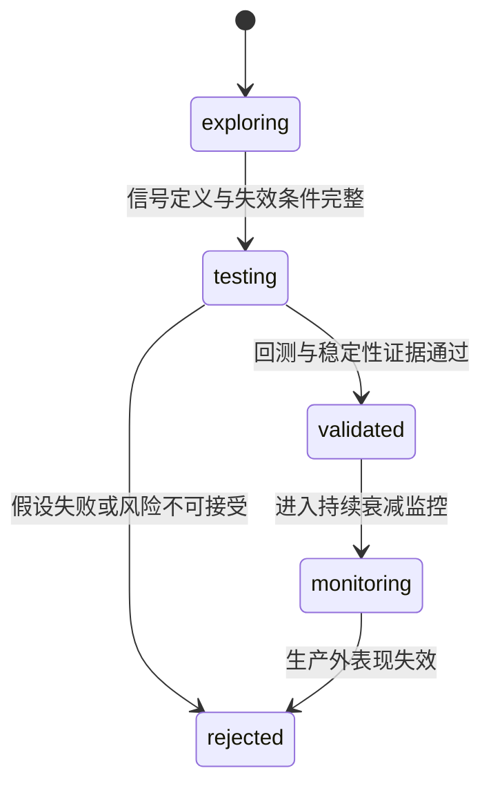

# Wyckoff 系统迭代与研究治理

> 本页只回答“下一步研究什么、证据达到什么标准才能晋级”。反馈表、动态策略字段和 Shadow 查询口径统一见
> [`SIGNAL_FEEDBACK_LOOP.md`](SIGNAL_FEEDBACK_LOOP.md)；Agent Runtime 的实现边界统一见
> [`ARCHITECTURE.md`](ARCHITECTURE.md#agent-架构)。

## 当前阶段

系统已经具备信号 outcome、健康度、生命周期、候选影子评分、入场质量和动态策略 Shadow。当前重点不是继续
增加规则，而是积累跨市场状态样本，证明新增信息能稳定提高收益/回撤比，并拒绝只在单一窗口有效的参数。

2026-07-28 的四层归因把这条要求变成了硬约束：现有 OHLCV 形态信号的 alpha 已量化为零，触发阈值、排序和
退出三层也逐一排除（见[下文结论](#l4-形态信号四层归因结论2026-07-28)）。因此新提案要先证明信息本身有
alpha，再谈怎么接。

| 研究方向 | 已有观测面 | 当前决策 |
|----------|------------|----------|
| 信号衰减 | SOS / Spring / LPS / EVR / Compression 的 outcomes 与 health | 继续积累多周期、分 regime 样本 |
| 动态分配 | 静态与动态候选的 `diff_added` / `diff_removed` | 保持 Shadow，未获正式晋级许可 |
| 信号生命周期 | `ACTIVE / WATCH / EXPERIMENTAL / RETIRED` | 保守处理冷启动，阈值待样本校准 |
| 外部观察 | L1/L2/L4 位置与后续 outcome | 仅作旁路验证，不晋级正式候选 |
| 候选影子评分 | S/A/B/C/D 档位与后续收益、回撤 | 仅作归因，不直接改排序 |
| 入场质量 | 相近上游优先级内的质量档位 | 仅允许窄 tie-breaker，继续验证 |
| 短线事件 | 未来 5 日命中、MFE、MAE 与 Top-K lift | 只读评估，不回写生产推荐 |
| 主题轮动 | `rotation_watch` 的短周期动量和宽度 | Shadow 提示，不改变主线确认或 OMS |
| 基本面质量 Overlay | 公告日前可见财报的 point-in-time 历史回放 | 0/3 周期通过，回测脚本已下线；仅作为读盘室按需查询工具（`analyze_stock mode=fundamental`），不接入 A股漏斗/Shadow/生产排序 |
| A股实证入场 | 弱水温仓位、NEUTRAL Spring 与广度确认 | 默认回测 A/M/P/Q，未验证前不改变生产漏斗 |
| L4 形态信号边际 | 五窗口约 9000 笔的无障碍毛漂移与日期配对 alpha | alpha≈0，四层已排除；停止形态参数迭代 |

### 基本面质量 Overlay 本地结论（2026-07-18）

本轮用固定随机种子的 300 只当前在市股票，在 2020 暴跌、2021 牛段、2022 熊段、2024 小盘弱势、
2025 反弹和 2026 近期六个窗口回放 884 笔交易。财报只允许使用 `announce_date < signal_date` 的记录，
测试动作固定为“剔除 `grade=weak`，未知样本保留”，持有期为 5/10/20 交易日。

- 三个持有期均未达到预注册晋级门槛；平均收益分别变化 -0.049pp、-0.335pp、-0.451pp。
- P10 分别恶化 -0.706pp、-0.536pp、-0.728pp，大亏率分别增加 1.269pp、1.113pp、3.633pp。
- 每个持有期都只有 3/6 窗口改善，未达到 60% 的跨窗口一致性门槛。
- `weak` 档 212 笔的均收为 -1.518%，反而好于 `strong` 的 -1.793% 和 `neutral` 的 -3.528%，
  说明这套通用质量阈值不能当作 Wyckoff 短中期信号的否决器。

结论为 `keep_research_only`：不改 confirmed、市场闸门、候选排序、Step3 或 OMS。回放仍有当前在市股票池的
幸存者偏差，且供应商历史财务可能含修订回填；这些限制只会降低晋级可信度，不构成放宽门槛的理由。

该回放脚本（`workflows/fundamental_overlay_backtest.py`）与其 CLI 入口已下线，结论存档于此。核心评分逻辑
（`core/fundamental_overlay.py`）保留，仅通过 `analyze_stock(mode="fundamental")` 暴露为 CLI/MCP/Web
Agent 读盘室的单股按需查询工具，不参与任何自动化排序或漏斗决策。

Web 端单股分析、多股对抗、持仓诊断页面（`web/packages/shared/src/agent-value.ts`）维护一套独立但核心逻辑对齐
的规则库：数据新鲜度阈值（550 天）、`veto` 级严重风险判定（多指标同时恶化或高杠杆叠加亏损）与背离信号
（利润/ROE 为正但经营现金流为负）在两端保持一致；输出结构因消费场景不同而分别面向 UI 展示
（`ValueScore`/`severe`）与 Agent 决策字段（`grade`/`action`/`position_cap`），不做强行统一。

## 研究对象与证据台账

每个策略增量先登记为研究假设，而不是直接变成生产开关：

`research_hypothesis` 记录 thesis、信号定义和失效条件；`research_evidence` 用稳定 `artifact_ref` 关联
`backtest`、`stability`、`attribution`、`shadow`、`report` 或 `observation`。状态只能通过
`research_transition` 合法迁移，普通字段更新不能绕过审计改变 status。

## 晋级证据门槛

`testing → validated` 至少需要最近的 `backtest=pass` 和 `stability=pass`，但这仍不等于生产交易许可。
晋级评审按以下顺序检查：

1. **处理暴露真实存在**：规则必须实际改变 `(signal_date, code)` 交易集合；零暴露只能记为 `no_effect`。
2. **跨周期有效**：近期、牛市、熊市都要覆盖，不能用单段行情代替稳健性。
3. **参数不孤立**：锚点附近至少有两个可比较邻居，且稳定邻居比例达到门槛。
4. **样本外不失效**：训练窗口选出的持有/退出参数在后续窗口原样测试，测试期不得重新选参。
5. **收益与风险同时改善**：不只看命中率，还看现金收益、最大回撤、MFE/MAE、赔率和尾部亏损。
6. **Shadow 贡献可解释**：`diff_added` 应持续优于 `diff_removed`，且不是由单一信号、单一行情或少数右尾交易驱动。
7. **人工复核通过**：数据口径、前视偏差、执行成本和回滚路径均明确后，才讨论生产开关。

Backtest Grid 输出跨周期确认、`parameter_stability.json` 和 `walk_forward_validation.json`，其
walk-forward 只验证持有期与退出参数：这类参数不改变信号集合，可以复用同一份信号台账。SOS、Spring、
LPS 等触发阈值改变的是"有哪些信号"，每个取值都要完整重跑漏斗，因此走独立的 Backtest Trigger
Calibration 流水线（见下节），其 `trigger_calibration_report.json` 才是触发器样本外验证的证据。
经典形态 B/C/D/E 在 2026-07-18 的三周期消融中未达到晋级要求：B 无真实暴露，
C/E 降低近期与牛市收益，D 没有经济改善。因此默认算力不再重复运行 B-E，只保留手动复验能力。

新的默认消融固定为 `A/M/P/Q`：A 是生产口径基线；M 在 NEUTRAL 与恐慌修复阶段缩小指定 confirmed
信号仓位；P 在 M 上仅将 NEUTRAL Spring 仓位由 50% 降至 25%，验证更小的左侧试探仓是否改善风险收益；Q 在 P 上只在
市场广度未确认时拦截 NEUTRAL Spring，不影响 EVR、SOS 等其他 confirmed 信号。默认对比覆盖近期六个月、2020 牛段、2022
熊段、2023 震荡和 2024 剧烈波动五个窗口，P 必须相对 M、Q 必须相对 P 评估。
此前 N 版本采用“过滤后重排”，在 2026-07-25 的五窗口结果中只在 2/5 个窗口改善、平均收益相对 M 下降 3.12pp；
O 采用“拦截后不补位”，在 run #85 中仅 2/5 个窗口优于 M、平均收益相对 M 下降 4.95pp，故两者均已拒绝且不作生产候选。策略只有在
五个窗口现金收益全部为正、最大绝对回撤不超过 20%，并继续满足处理暴露、相对收益和回撤恶化门槛时才可
标记 `pass`。A/M/P/Q 都是回测研究策略，不会因单次胜出自动改写
生产漏斗、Step3 或 OMS。

`pending_mode=only` 的报告必须把成交触发器显示为实际 confirmed 信号族；同一股票当日还命中更高分的
未确认形态时，可以保留更高数值供归因，但不能把标签降级成裸 `spring` / `sos`。`both` 研究模式仍按
更强来源展示，避免把合流实验误报为 confirmed-only。

## 触发阈值标定

`backtest_trigger_calibration.yml` 用 `--trigger-grid <param>=<v1,v2,...>` 逐取值完整重跑全市场漏斗，
再由 `scripts/build_backtest_trigger_report.py` 汇总成跨周期 walk-forward 结论。全量股票池下单次重跑
实测 80-95 分钟，因此流水线按"周期 × 取值"扇出成独立 job（四个取值串行会逼近 GitHub 的 6 小时 job
上限），快照则按周期拉取一次供该周期各取值复用。汇总脚本按 `(param, period, value)` 去重合并，扇出
产生的多份单行 `trigger_matrix_<param>.json` 会自动并成完整矩阵。以下三条口径针对触发阈值，必须保持，
否则结论不成立（扫 `top_n` 时口径不同，见下一节）：

- **不复用信号台账**：阈值改变的是信号集合本身，只有整轮重跑才能得到对应的候选与成交。
- **看目标触发器而非组合**：只改一个触发器的阈值时，组合收益会被其它触发器稀释；因此按
  `stratified.by_trigger` 取该触发器的合并笔数与均收作为选值依据。
- **放开每日候选上限**：标定用 `top_n=0`。生产网格的 `top_n=1` 会把大部分受影响候选截断在成交之外，
  阈值改动看起来"无效"其实只是没被选中。

选值规则是训练期内该触发器均收最大，但先剔除样本低于 `MIN_TRIGGER_TRADES` 以及笔数不足同周期最高
笔数 `TRADE_COLLAPSE_FLOOR` 的取值——放大阈值总能靠减少交易抬高均收，笔数约束就是防这一手。训练期
选出的取值原样拿到下一周期检验，只有在样本外仍不劣于该周期最优取值时窗口才算通过；未过半的结论按
`fail` 处理，窗口不足两个记 `review`，都不足以改写生产阈值。

## 选择层增益

同一条流水线传 `--trigger-grid top_n=0,1` 时扫的不是检测阈值而是每日候选上限，衡量的是排序/选择层
相对原始 L4 信号池的增益。它和阈值标定共用扇出与汇总，但读数口径完全不同，不能混：

- **看全样本而非单触发器**：`top_n` 不属于任何一个触发器，比较的是两次运行各自台账的全样本均收。
- **不做 walk-forward 选值，也不套笔数约束**：问题是"排序层是否加分"，每个周期都是一次独立检验；
  而且 `top_n=1` 的笔数按定义就远低于全池，阈值标定那套"笔数崩塌即淘汰"的规则会直接判错。
- **基线是最小取值**：`top_n=0` 即不截断的原始信号池，增益 = 该取值均收 − 基线均收。

判定沿用 `pass` / `fail` / `review`：所有周期增益为正才算 `pass`，任一周期为负记 `fail`，可比周期不足
两个记 `review`。这条实验的前提是原始信号池本身几乎没有毛边际（1% 双边摩擦后净值为负），因此若
`top_n=1` 也没有稳定正增益，问题就不在阈值而在排序层本身。

## 原始信号池的退出基准

同一条流水线的 `grid_cells` 入口（格式 `hold:stop:take:trail`）走共享信号台账：退出参数不改变信号
集合，一次漏斗可以喂给多个退出格，因此只按周期扇出，不再按取值扇出。它回答的是 Backtest Grid 答不
了的问题——后者固定 `top_n=1`，看到的退出表现已经被排序层筛过一轮。

`stop` 与 `take` 同时填 0 即关闭障碍（`sltp` 模式下两者非负就不设价位，直接落到时间退出），配合多个
`hold` 就能读出信号在各持有期的无条件毛漂移。这个数是判断"信号本身无效"还是"退出规则毁掉信号"的
唯一依据：带障碍运行里时间退出那一档的均收是**幸存者条件均值**（被止损打掉的样本已经剔除），不能
直接当作无条件漂移使用。走这条通道时不产出 trigger matrix，汇总 job 自动跳过，结果直接看各格 summary。

## L4 形态信号四层归因结论（2026-07-28）

用上述三条通道在 bull_2020 / bear_2022 / sideways_2023 / volatile_2024 / recent_6m 五个窗口、全量 A 股池、
`top_n=0`（全部 L4 confirmed 信号，约 9000 笔）依次测量了四层，没有一层贡献边际。

1. **触发阈值**：`spring_vol_ratio` 四取值跨周期 walk-forward，各周期最优值互相矛盾（1.3 / 1.1 / 1.8 / 1.3）
   且全为负，判定 `fail`。
2. **排序层**：`top_n=1` 相对 `top_n=0` 五周期平均 **-0.259pct**，2/5 为正；sideways_2023 与 volatile_2024
   分别只强过「从当期全池随机抽同样笔数」的 3.4% 与 6.2%。打分与收益在各触发器**内部**的 Spearman 在
   -0.058~+0.010，而分数五分位的止损率从 21.6% 单调升到 32.1%——打分实为波动率代理。且分数中位数按触发器
   排序（lps 0.33 < trend_pullback 0.44 < compression 0.67 < evr 2.25 < spring 2.38 < sos 4.34）与各触发器
   alpha 几乎相反。
3. **退出规则**：同一份台账下 10 日「有障碍 vs 无障碍」毛均收只差 **-0.039pct**，5 个窗口中 3 个障碍略微
   有利。逐笔配对显示被止损的样本放任后平均 -7.4%~-7.7%（止损执行 -8.1%），止盈样本放任后 +16.3%~+18.2%
   （止盈锁定 +18.5%），两侧接近对冲。带障碍运行里 `time_exit` 那档的 +0.897% 是**幸存者条件均值**，
   无条件值只有 +0.050%。
4. **信号生成**：无障碍毛漂移 5/10/15/20 日为 +0.112 / +0.050 / -0.311 / -0.796（后两者 t=-2.52 / -5.88），
   持有越久越亏，不存在「漂移需要更长时间兑现」。按每笔自身 `entry_date` 开盘、`exit_date` 收盘取全市场
   等权均值作日期配对基准后，alpha 为 -0.040 / -0.126 / -0.090 / -0.081，|t| 全部 < 1.3。

10 日 alpha 按触发器：trend_pullback +0.306(t=0.79)、lps +0.033(0.28)、compression -0.505(-1.25)、
evr -0.547(-1.46)、sos -1.414(-1.34)、spring **-0.558(t=-2.66)**。trend_pullback 的 +1.099% 毛漂移几乎全是
beta；spring 是唯一统计上非零者且为负，六重比较下刚好压 Bonferroni 线，不作铁证但需警惕——它恰是 top-1
选择中占比最高（33%-57%）的触发器。

净亏损已完全拆开：alpha≈0、基准漂移 +0.18%、摩擦 -1.0%（其中 0.9pct 来自 `BACKTEST_*_FRICTION_PCT` 默认
0.5%/边的滑点假设，实际费率仅 0.09%）。即便把滑点降到 0.1%/边，净收也只从 -0.95% 变为 -0.15%，因为分子上
没有 alpha。按 10 日持有折算，1% 双边摩擦相当于每年约 24pct 的拖累，这是任何高换手形态策略必须先跨过的门槛。

**决策**：停止在现有 OHLCV 形态特征上迭代阈值、排序与退出参数。后续任何新增信息必须先在同一口径下
（日期配对的全市场等权基准、无障碍毛漂移）证明 alpha 非零，才讨论接入漏斗。本结论的复现口径见上三节。

## 后续两条路（不再调现有形态参数）

四层排除后只剩两条前进方式，且都必须先证明「比日期配对的全市场等权基准多赚」，再谈接入生产。

### 路径 A：换信息源（在现有漏斗上加正交特征）

当前 L4 只吃 OHLCV 形态；与价格高度共线的量价特征已被证明无 alpha。要找的是**价格本身不包含**的信息，例如：

| 信息源 | 仓库现状 | 正确用法 |
|--------|----------|----------|
| 龙虎榜 / 融资融券 / 大宗 | `integrations/external_capital_context.py` 已按需拉取，写入 `signal_observations.features_json.source_context` | 已是 observation，**禁止**直接改候选池；先用 outcomes 测「有净买 vs 无」的 alpha |
| 候选影子分 | `candidate_shadow_score` 已合成外部资金等组件 | 继续走 `evaluate_recommendation_events` 的 top-k lift；lift 稳定为正才考虑升成排序键 |
| 新闻 / 舆情 | `news_intelligence` + `rag_veto` 已做否决层 | 可先做事件日前后的异常收益，而不是再加一层形态阈值 |
| 财报 / 公告时点 | 尚未系统接入回测 | 事件研究：公告日 T 的 N 日前瞻，相对同日全市场 |

接入纪律（和 Android 里「先离线 A/B，再上线 Feature Flag」同一套）：

1. **只读历史对齐**：特征必须是信号日收盘前已知（point-in-time），禁止用当前截面行业/财务回填历史。
2. **先测 alpha，再接线**：在已有信号台账或独立事件表上，按「日期配对全市场等权基准、无障碍毛漂移」算 alpha；|t| 不够或跨周期不稳 → `rejected`，不进漏斗。
3. **接线顺序**：observation → shadow 排序对照 →（通过后）才改正式候选/AI 池/OMS。现成的 `external_capital` 与 `candidate_shadow_score` 已停在第 1～2 步，下一步是把 outcomes 样本跑够，而不是再写拉取代码。
4. **摩擦门槛**：10 日持有下 1% 双边摩擦约合每年 24pct；新特征的毛 alpha 若撑不过摩擦，不值得高换手执行。

### 路径 B：换问题形式（不再做「每日择一只做 10 日波段」）

现有问题是：每天从 L4 形态池里挑票 → 持有约 10 日 → 靠双边交易赚钱。摩擦把几乎为零的 alpha 打成亏损。换问题形式 = 换**决策对象、持有期或比较方式**，例如：

| 问题形式 | 在问什么 | 为何可能绕过当前死局 |
|----------|----------|----------------------|
| **截面排序（cross-section）** | 同一天里，特征高的一组是否跑赢特征低的一组？ | 多空或相对强弱，不依赖绝对漂移；可用分位数多空组合衡量，摩擦模型也不同 |
| **事件驱动（event study）** | 某类事件发生后 N 日是否有异常收益？ | 交易次数由事件频率决定，不是每日必做；样本稀疏但 alpha 可能更大 |
| **过滤而非选股** | 形态信号是否只适合用来「排除」而不是「买入」？ | spring 已显示负 alpha：若当否决层（有 spring 则不买），可能改善其它策略，而不是当入场信号 |
| **更长持有 / 更低换手** | 月度再平衡或主题持有是否有边际？ | 摩擦按年摊薄；但当前 15/20 日无障碍漂移已为负，须先证明更长窗口有正 alpha，不能默认「拿久一点就好」 |

落地时仍用同一套证据门槛：跨 bull/bear/sideways/volatile/recent 窗口、日期配对基准、样本外 walk-forward。换问题不等于放松纪律。

## 截面因子前瞻筛查（2026-07-28）

在五个回测窗口上，用 Tushare `daily_basic` + `moneyflow` 与快照价量做截面分位筛查：D 日收盘观测因子，
D+1 开盘买入、D+HOLD 收盘卖出；收益减当日全市场等权均值；剔除 ST 与次日涨停开盘。通过门槛同时要求
跨窗同号 ≥4/5、Newey–West `|IC_t| > 2`、分位单调 `|ρ| > 0.7`。

| 结论 | HOLD=5 | HOLD=10 |
|------|--------|---------|
| **通过** | 账面市值比 1/PB（4/5，IC_t=2.62，单调 0.76，spread +0.35） | 同一因子（4/5，IC_t=2.33，单调 0.76，spread +0.64） |
| 接近但未过 | 股息率（IC_t=1.94）、盈利收益率（单调 0.69） | 股息率 / 盈利收益率 / 销售市值比（IC_t 1.7–1.9） |
| **资金流** | 主力净流入比、小单净流入比、超大单参与度、主力净流入额均未过 | 同左；超大单参与度 \|IC_t\| 高但同号仅 3/5、单调不足 |
| 对照（价量） | 换手率 / 波动 / 流动性有统计强度，但多为「最高分位悬崖」而非单调，且 3/5 窗异号 | 同左 |

含义：

1. **筛查架子是通的**：价值类对照能读出正号，不是口径写坏了。
2. **日频资金流不能当形态策略的补丁**：在「每日截面、5–10 日持有」问题上 alpha 不稳，继续接龙虎榜/大单进漏斗前仍须单独事件研究，不能默认「有资金痕迹就加分」。
3. **BP 是弱但干净的截面信号**：顶底分位 10 日超额约 0.64pct；若做成高换手只做多顶分位，摩擦仍可能吃掉大半。更合理的用法是截面相对强弱或更低换手再平衡，而不是塞回现有每日 top_n=1 波段。
4. **换手率**跨窗同号且 \|IC_t\| 高，但分位曲线几乎平坦、仅最高档崩塌——适合做「极端换手否决」，不适合当单调排序键。

复现：`/tmp/factors/screen.py <hold>`（依赖 `/tmp/snap/*/hist_full.csv.gz` 与 `/tmp/factors/*/daily_basic|moneyflow.parquet`）。

## 合成价值分的组合级验证（2026-07-28）

单因子 BP 收窄到 40 只时 t 掉到 0.39——分位级 alpha 被个股特异波动稀释，不可直接实现。改用
BP / 盈利收益率 / 销售市值比 / 股息率 四项按日秩标准化后取均值，只做多合成分最高的 N 只、
固定间隔再平衡，基准为当日全市场等权。

| 持仓 × 再平衡 | 毛 alpha（%/年） | t(n=5) | 年换手 | 净 @1.0% | 净 @0.4% |
|---|---:|---:|---:|---:|---:|
| 30 × 10 日 | 8.89 | 3.35 | 322% | 5.67 | 7.60 |
| 50 × 10 日 | 10.57 | 3.57 | 298% | 7.58 | 9.37 |
| 200 × 10 日 | 11.19 | 4.27 | 226% | 8.93 | 10.29 |
| 50 × 20 日 | 7.65 | 1.27 | 217% | 5.48 | 6.78 |

网格八格全为正号，持仓越分散越强（个股特异风险被摊薄），与「因子真实但单票信噪比低」一致。
两项证伪检验都没打倒它：

- **不是小市值的代理**：在市值三档内部各自选股再合并，年化 alpha 从 7.03 升到 11.66（t=3.44）。
  但强度集中在小盘（小 21.3 / 中 10.5 / 大 3.2），容量有限——在当前资金规模下不构成约束。
- **不是幸存者偏差堆出来的**：补回 425 只被漏掉的股票后，毛 alpha 从 9.38 变 9.13，偏差只值 +0.25pct/年。

已知弱点：五个窗口是人工挑的代表性区间、彼此不独立，`sideways_2023` 单窗为负；基准是不可直接买入的
全市场等权；Tushare `daily_basic` 的 PIT 正确性（财报追溯重述）未独立核对；300% 的年换手对价值类策略
偏高，缓冲式再平衡（跌出 top 2N 才卖）应能压下来但尚未验证。

以上数字来自一次性脚本，只算「持仓收益减当日全市场等权」，没有账户、没有一手制、没有最低佣金。真正的
可执行结论以 `factor_backtest.yml` 的组合级回测为准，下一节记录该引擎在建成过程中推翻的三处口径。

## 组合级引擎揭示的三处口径错误（2026-07-28）

把上一节的截面统计做成真正的组合回测后（`core/factor_portfolio.py`），用「把分数换成随机数、零摩擦下
净值必须贴住基准」这一条空假设做回归，连续暴露出三个会凭空造 alpha 的口径问题。它们在只算收益均值的
一次性脚本里全都看不见：

| 问题 | 随机打分的假 alpha | 成因 | 处理 |
|------|---:|------|------|
| 基准与组合再平衡频率不同 | ~9 pct/年 | 每日等权基准每天把权重摊回等权，趋势下跌时等于每天加仓下跌股，与 K 日持有不可比 | 增加 `holding_period_benchmark`，同调仓日、同次日开盘换手 |
| 一手买不起就跳过该仓位 | ~8 pct/年 | 每格预算 2000 元时，一手价超过预算的标的被静默跳过，等于按股价做隐性筛选 | 候选给到空位数的 4 倍，沿排名继续补位 |
| 零头现金不回收 | 数 pct/年（下跌市） | 固定 `equity/top_n` 预算在每格都截掉不足一手的部分，几十格累计空转两成仓位，而下跌市里持币本身是正 alpha | 预算改为「剩余现金 / 剩余空位」滚动 |

修完之后随机打分在零摩擦下的 alpha 从 +7.96% 降到 +2.12%（6 个种子，单种子离散度 ±4%），进入噪声区间。
三条断言已固定为测试，其中两条做过变异验证（改回旧实现会失败）。

另外两处未来函数一并修掉：给买单定预算用了当日收盘估值（开盘下单时还不知道），停牌期间用了该股在整个
面板里的最后价格（可能是复牌后的价）。

**一手制是这个资金规模下的硬约束**：100k 分 50 格，每格 2000 元，一手 20 元以上的股票就买不进。这不是
可以忽略的细节——它决定了「持仓数」这个参数的上限，也是一次性脚本与真实账户结果分叉的主因。

## 快照股票池带幸存者偏差

`snapshot_data/*/hist_full.csv.gz` 的符号集是 `name_map.json` 的严格子集，而 `name_map` 按**拉取当时**
的存续名单生成，且不含 ST。因此任何历史窗口的回放都自动排除了两类股票：拉取日之前已退市的（乐视网、
千山药机等），以及拉取日处于 ST 状态的（约 209 只）。每个窗口合计漏掉约 7.5% 的可交易标的。

方向是乐观偏差，且集中在「便宜且困境」这一段，所以对价值类结论的影响远大于对动量类。已验证的量级见
上一节（+0.25pct/年）。同理，L4 形态信号「无 alpha」的结论只会因此更强，不会被推翻。

补齐方式：`stock_basic(list_status='D')` 取退市日，`list_status='L'` 取含 ST 的全量存续名单，两者并集
减去快照池即为缺口；`daily_basic` 本身按 `trade_date` 全市场拉取，不受影响。

截面路径已绕开这个问题：`integrations/factor_panel.py` 不预先取名单，直接按 `trade_date` 横切拉全市场，
当天在交易的股票必然在面板里。形态信号那条路仍在用旧快照，修它需要改
`workflows/backtest_snapshot_fetch.py` 的 `_load_symbols`。

## Shadow 到生产的边界

`FUNNEL_DYNAMIC_POLICY=shadow` 只记录动态候选差异。切到 `on` 前必须同时满足：

- `policy_governor` 不再要求补样本或回测；
- `promotion_checklist` 的样本、差异表现、scoped 调权和回测确认均通过；
- `formal_dynamic_allowed=true`；
- 人工确认最新报告来源、freshness、作用范围和回滚方式。

`manual_review_required` 只表示可以开始人工评审，不能解释为自动批准。信号级调权、主题轮动、候选影子分
和 AI 结论都不能单独打开市场总闸或越过 OMS。

## 研究优先级

| 优先级 | 工作 | 完成定义 |
|--------|------|----------|
| P0 | 修复数据泄漏、标签污染、候选与回测口径不一致 | 同一输入在实盘与回放得到同一候选语义 |
| P0 | **停止**在 OHLCV 形态阈值 / 排序 / 退出参数上迭代 | 见「L4 形态信号四层归因结论」；再开此类实验须先说明为何结论不适用 |
| P0 | 在 2018 至今的连续历史上跑截面组合回测 | 引擎已建成（`factor_backtest.yml`）；需给出全周期净值、分年度 alpha 与摩擦拆解，判定是否值得实盘 |
| P1 | 修正形态信号快照股票池的幸存者偏差 | 拉取时并入已退市与 ST 标的，`name_map` 记录 PIT 名称；截面路径已不受影响 |
| P1 | 验证已有 Shadow 外部资金与候选影子分 | 多个窗口相对「仅漏斗分」有稳定 top-k lift 或 alpha；否则标 `rejected` |
| P2 | 新信息源的前瞻筛查 | 日频 moneyflow 在 5–10 日截面上未过门槛，暂不接回每日形态 top_n |
| P2 | 将通过筛查的特征接入正式排序或事件策略 | 走 Shadow→生产边界；不跳过 outcomes |
| P3 | 展示和解释优化 | 不改变任何计算、晋级或交易权限 |

## 反过拟合纪律

- 不因最近一次回测或单个榜单调整生产阈值。
- 不把 GitHub Actions 成功、AI 高置信度或高命中率单独当作策略通过。
- 不用当前截面行业、概念、财务或幸存股票池伪装 point-in-time 安全结果。
- 不同时改多个变量后归因到其中一个规则。
- 不用复利曲线、少数大赚交易或未经成本约束的收益掩盖弱周期亏损。
- 允许研究结论为 `rejected`；删除无效复杂度也是有效迭代。

## 运营复盘

日常复盘只看四层：

1. 数据是否完整、新鲜、可复现；
2. 信号与 Shadow 是否有足够成熟 outcome；
3. 跨周期、稳定性和样本外证据是否一致；
4. 当前结论是继续观察、拒绝、人工评审，还是已获正式许可。

具体表、字段、Agent/Web 展示口径和排查顺序由
[`SIGNAL_FEEDBACK_LOOP.md`](SIGNAL_FEEDBACK_LOOP.md) 统一维护，避免在路线图里复制实现细节。
